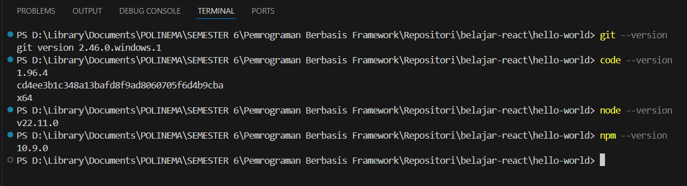
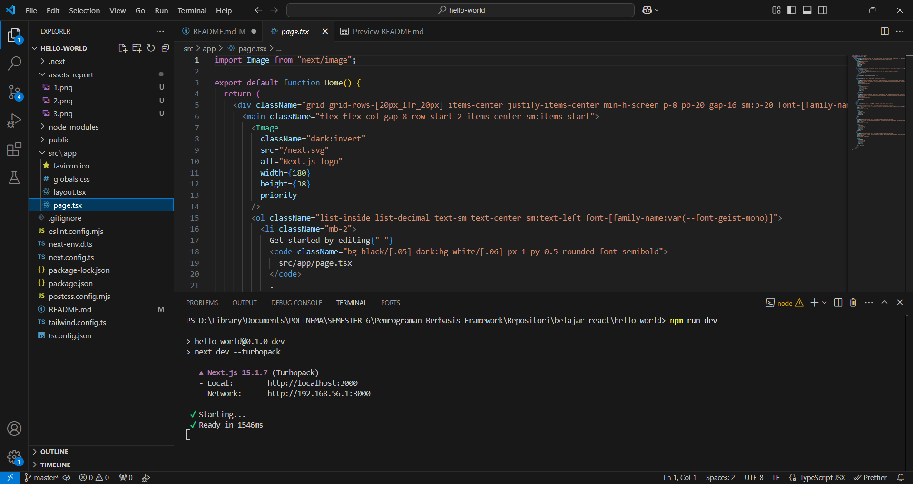
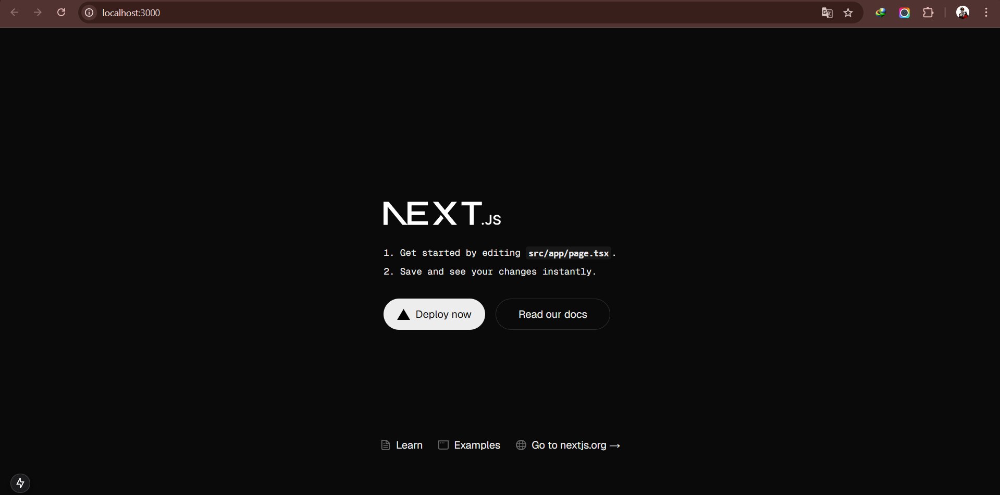
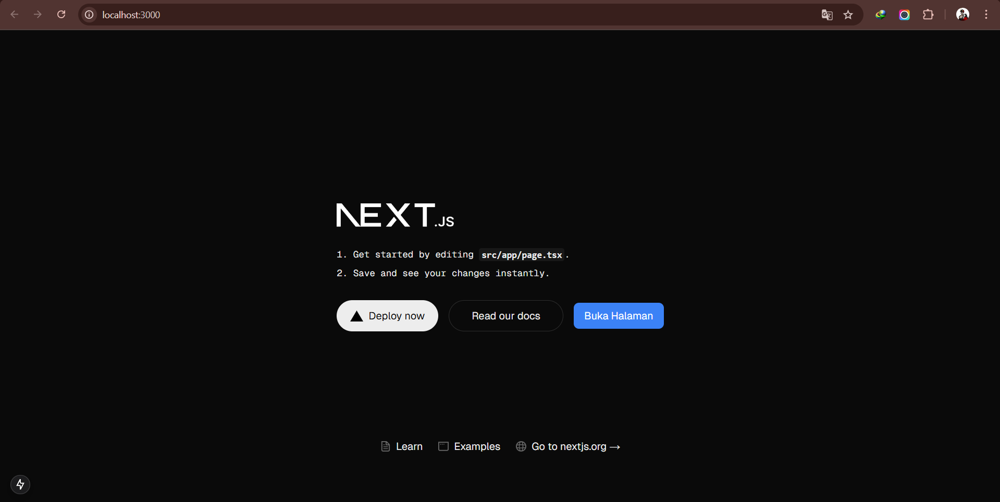
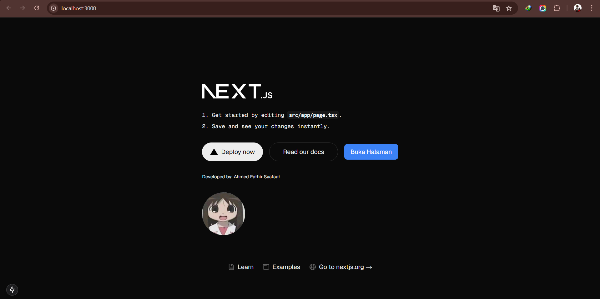

This is a [Next.js](https://nextjs.org) project bootstrapped with [`create-next-app`](https://nextjs.org/docs/app/api-reference/cli/create-next-app).

## Getting Started

First, run the development server:

```bash
npm run dev
# or
yarn dev
# or
pnpm dev
# or
bun dev
```

Open [http://localhost:3000](http://localhost:3000) with your browser to see the result.

You can start editing the page by modifying `app/page.tsx`. The page auto-updates as you edit the file.

This project uses [`next/font`](https://nextjs.org/docs/app/building-your-application/optimizing/fonts) to automatically optimize and load [Geist](https://vercel.com/font), a new font family for Vercel.

## Learn More

To learn more about Next.js, take a look at the following resources:

- [Next.js Documentation](https://nextjs.org/docs) - learn about Next.js features and API.
- [Learn Next.js](https://nextjs.org/learn) - an interactive Next.js tutorial.

You can check out [the Next.js GitHub repository](https://github.com/vercel/next.js) - your feedback and contributions are welcome!

## Deploy on Vercel

The easiest way to deploy your Next.js app is to use the [Vercel Platform](https://vercel.com/new?utm_medium=default-template&filter=next.js&utm_source=create-next-app&utm_campaign=create-next-app-readme) from the creators of Next.js.

Check out our [Next.js deployment documentation](https://nextjs.org/docs/app/building-your-application/deploying) for more details.

## Laporan Praktikum

|  | Pemrograman Berbasis Framework 2025 |
|--|--|
| NIM |  2241720083 |
| Nama |  Ahmed Fathir Syafaat |
| Kelas | TI - 3C |


### Praktikum 1: Menyiapkan Lingkungan Pengembangan
1. Jelaskan kegunaan masing-masing dari Git, VS Code dan NodeJS yang telah Anda install pada sesi praktikum ini!
> - Git merupakan Sistem kontrol versi untuk melacak perubahan kode, kolaborasi tim, dan menyimpan proyek di repository seperti GitHub.
> - VS Code merupakan code editor yang digunakan untuk menulis, mengedit, dan mengelola kode dengan berbagai ekstensi pendukung pengembangan aplikasi.
> - NodeJS merupakan runtime JavaScript untuk menjalankan JavaScript di luar browser, berguna untuk pengembangan backend, serta menyediakan NPM untuk mengelola package dan dependensi proyek.

2. Buktikan dengan screenshoot yang menunjukkan bahwa masing-masing tools tersebut telah berhasil terinstall di perangkat Anda!
> 


### Praktikum 2: Membuat Proyek Pertama React Menggunakan Next.js

1. Pada Langkah ke-2, setelah membuat proyek baru menggunakan Next.js, terdapat beberapa istilah yang muncul. Jelaskan istilah tersebut, TypeScript, ESLint, Tailwind CSS, App Router, Import alias, App router, dan Turbopack!
> - TypeScript merupakan bahasa pemrograman berbasis JavaScript dengan tipe data statis untuk mencegah error saat coding.
> - ESLint merupakan alat untuk memastikan kode tetap rapi dan mengikuti standar penulisan yang baik.
> - Tailwind CSS merupakan framework CSS yang menyediakan class siap pakai untuk mempercepat desain tampilan.
> - App Router merupakan sistem routing Next.js terbaru yang menggunakan folder app/ untuk mengatur halaman.
> - Import Alias merupakan cara mempersingkat path saat mengimpor file dalam proyek, misalnya ../../components/Navbar menjadi @/components/Navbar.
> - Turbopack merupakan pengganti Webpack yang lebih cepat dalam memproses dan menjalankan proyek Next.js.

2. Apa saja kegunaan folder dan file yang ada pada struktur proyek React yang tampil pada gambar pada tahap percobaan ke-3!
> - .next/ merupakan folder hasil build Next.js yang dihasilkan secara otomatis setelah menjalankan proyek.
> - node_modules/ merupakan folder untuk menyimpan semua dependensi atau package yang diinstal melalui npm atau yarn.
> - public/ merupakan file statis seperti gambar, ikon, atau aset lain yang dapat diakses langsung oleh browser.
> - src/app/ merupakan folder utama dalam sistem App Router Next.js yang berisi halaman dan komponen utama proyek.
> - layout.tsx merupakan komponen utama yang menangani layout dasar aplikasi, seperti header dan footer.
> - page.tsx merupakan file utama yang berisi halaman utama dari aplikasi.

3. Buktikan dengan screenshoot yang menunjukkan bahwa tahapan percobaan di atas telah berhasil Anda lakukan!
> 

> 

### Praktikum 3: Menambahkan Komponen React (Button)

1. Buktikan dengan screenshoot yang menunjukkan bahwa tahapan percobaan di atas telah berhasil Anda lakukan!

> 

### Praktikum 4: Menulis Markup dengan JSX

1. Untuk apakah kegunaan sintaks user.imageUrl?
> Sintaks user.imageUrl digunakan untuk mengambil nilai dari properti imageUrl dalam objek user, nilainya berisi URL gambar yang nanti ditampilkan sebagai sumber pada elemen img. 

2. Buktikan dengan screenshoot yang menunjukkan bahwa tahapan percobaan di atas telah berhasil Anda lakukan!
> 